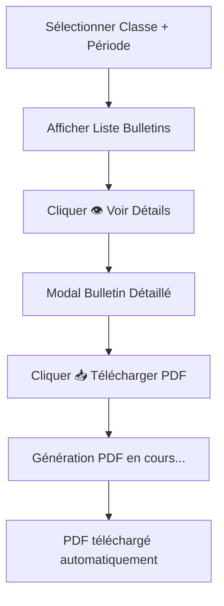

# 📄 Génération PDF des Bulletins - Guide d'Utilisation

## 🎯 **Nouvelle Fonctionnalité Implémentée**

Le système permet maintenant de **générer et télécharger les bulletins détaillés en format PDF** avec une présentation professionnelle.

## 🚀 **Comment Utiliser**

### 1. **Accéder à la Génération PDF**
```
1. Gestion des Bulletins → Sélectionner Classe + Période
2. Cliquer sur 👁️ (bouton bleu) pour ouvrir le bulletin détaillé
3. Cliquer sur "📥 Télécharger PDF" (bouton vert) dans la modal
```

### 2. **Processus de Génération**
- Le bouton affiche "Génération..." pendant le traitement
- Le PDF est automatiquement téléchargé dans le dossier de téléchargements
- Nom du fichier : `Bulletin_NomEleve_Periode.pdf`

## 📋 **Structure du PDF Généré**

### 📊 **En-tête**
- **Titre** : "BULLETIN SCOLAIRE" (centré, en gras)
- **Sous-titre** : Période et année académique
- **Ligne de séparation** bleue

### 👤 **Informations Élève**
- Nom de l'élève et classe
- Période et année académique
- Mise en page en deux colonnes

### 📈 **Résumé des Performances**
- **Moyenne Générale** avec pourcentage
- **Rang** dans la classe (ex: 3ème / 25)
- **Moyenne de Classe** pour comparaison

### 📚 **Détail des Notes par Matière**

#### Structure par Matière :
1. **En-tête Matière** (fond bleu)
   - Nom de la matière (ex: "Mathématiques")
   - Moyenne de la matière (ex: "Moyenne: 85.2%")

2. **Informations Complémentaires**
   - Coefficient de la matière
   - Points pondérés (moyenne × coefficient)
   - Nombre d'évaluations

3. **Liste des Évaluations**
   - Titre de l'évaluation
   - Note obtenue / Note maximale
   - Pourcentage calculé
   - Commentaire (si présent)

### 💬 **Commentaire Général**
- Section dédiée pour les commentaires du professeur principal
- Texte adaptatif sur plusieurs lignes si nécessaire

## 🎨 **Exemple de Contenu PDF**

```
BULLETIN SCOLAIRE
1er Trimestre - 2024-2025

INFORMATIONS ÉLÈVE
Élève: Marie Dupont          Classe: 6ème A
Période: 1er Trimestre       Année: 2024-2025

RÉSUMÉ DES PERFORMANCES
Moyenne Générale: 85.2%      Rang: 3ème / 25
Moyenne de Classe: 78.1%

DÉTAIL DES NOTES PAR MATIÈRE

[MATHÉMATIQUES]                    Moyenne: 90.0%
Coefficient: 4    Points: 360.0    Évaluations: 3

Évaluations:
• Contrôle Algèbre: 18.0/20 (90.0%)
  "Excellent travail, continuez ainsi"
• Devoir Géométrie: 16.5/20 (82.5%)
• Interrogation Tables: 19.0/20 (95.0%)

[FRANÇAIS]                         Moyenne: 82.5%
Coefficient: 4    Points: 330.0    Évaluations: 2

Évaluations:
• Dictée: 15.0/20 (75.0%)
• Rédaction: 18.0/20 (90.0%)
  "Très bonne expression écrite"

COMMENTAIRE GÉNÉRAL
Élève sérieuse et appliquée. Excellent trimestre avec 
des résultats très satisfaisants dans toutes les matières.
Continuez dans cette voie !
```

## ⚙️ **Aspects Techniques**

### Bibliothèques Utilisées
- **jsPDF** : Génération du document PDF
- **Polices** : Helvetica (support natif PDF)
- **Format** : A4 (210mm × 297mm)

### Fonctionnalités Avancées
- **Pagination automatique** : Nouvelle page si contenu trop long
- **Mise en page responsive** : Adaptation au contenu
- **Caractères spéciaux** : Support français (accents, cédilles)
- **Gestion d'erreurs** : Messages d'alerte en cas de problème

## 📱 **Interface Utilisateur**

### Bouton de Téléchargement
- **Position** : En haut à droite de la modal détaillée
- **Style** : Vert avec icône de téléchargement
- **États** :
  - Normal : "📥 Télécharger PDF"
  - En cours : "Génération..." (bouton désactivé)

### Expérience Utilisateur
- Temps de génération : 1-3 secondes
- Aucune popup intrusive
- Téléchargement automatique
- Nom de fichier informatif

## 🔧 **Workflow Complet**



## ✅ **Avantages de la Fonctionnalité**

1. **Archivage** : Bulletins sauvegardables hors ligne
2. **Impression** : Format PDF optimisé pour l'impression
3. **Partage** : Envoi facile aux parents par email
4. **Présentation** : Mise en page professionnelle et lisible
5. **Conformité** : Respect des standards de bulletins scolaires

## 🏆 **Résultat Final**

La génération PDF est maintenant **entièrement opérationnelle** ! Les enseignants peuvent :
- ✅ Consulter les bulletins détaillés à l'écran
- ✅ Générer des PDF avec structure professionnelle
- ✅ Télécharger automatiquement les documents
- ✅ Obtenir tous les détails par matière et évaluation
- ✅ Avoir un document prêt pour impression/archivage

**La fonctionnalité PDF est 100% fonctionnelle ! 🎉**
